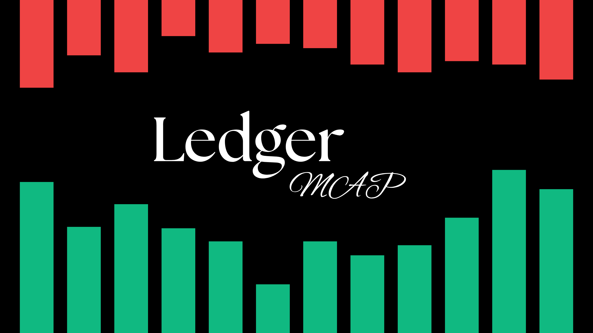
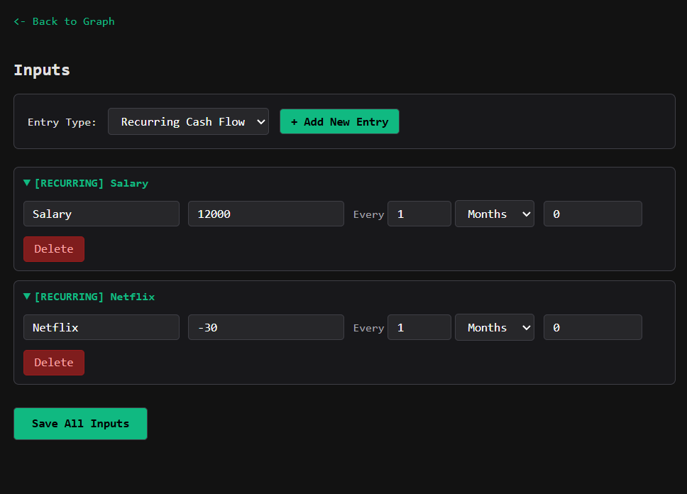

    

LedgerMap is a desktop financial visualization tool built with Electron. It helps you forecast and graph your cash flow by managing recurring payments, singular expenses, loans, etc.

    

## Features

* **Cost Forecasting:** Visualize how your money flows over time through dynamic graphs.
* **Recurring Payments:** Track subscriptions, bills, and regular income.
* **Singular Expenses:** Log one-off purchases.
* **Loan Tracking:** Keep tabs on loans and see how they impact your overall financial timeline.
* **Toggle inputs:** Include or exclude values to see how they affect the values.
* **Remembers state:** The program remembers your inputs (stored in `localStorage`) even after closing.
* **Import/Export:** Inputs can be stashed away as JSON data which can be imported back in.
* **Cross-Platform:** Uses Electron, thus compatible on any OS.

---

*This project is licensed under the MIT license. See [LICENSE](LICENSE) for more details.*
